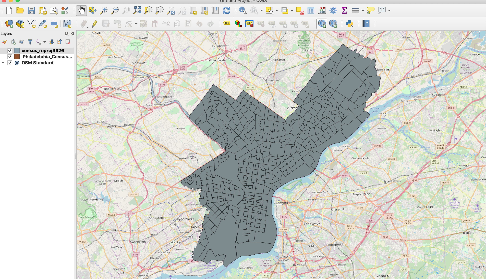

## A Simple, Queryable Vector Backend

### Setup
To play around with this example, a couple prerequisites:
1. You must have a working python installation with GDAL bindings. This
   can be tricky! Feel free to use a docker container or a python distribution
   (like Anaconda) if installation of GDAL + python bindings proves
   difficult. This is required to read shapefiles and deal with
   geometries.
2. The python package `flask`. This provides the code which handles
   requests and serves responses.

### Data
The data we will be querying is a census tracts shapefile (manually reprojected
from EPSG:2272 to EPSG:4326 via QGIS, though you can do this programmatically!).
Here's what it looks like, in full:


### Running the Server

Once these pieces are in place, we should be able to spin up the server
and start querying the provided [census_tracts](census_tracts/) by typing:
```bash
FLASK_RUN_HOST=0.0.0.0 FLASK_APP=serve.py flask run * Serving Flask app "serve.py"
```

If successful, you'll see some startup messages like this:
```
 * Environment: production
   WARNING: Do not use the development server in a production environment.
   Use a production WSGI server instead.
 * Debug mode: off
 * Running on http://0.0.0.0:5000/ (Press CTRL+C to quit)
```

To actually use the server, make requests against these endpoints:
- `localhost:5000/lt/{ID}` (return geojson for all OBJECTIDs less than `ID`)
- `localhost:5000/eq/{ID}` (return geojson for all OBJECTIDs equal to `ID`)
- `localhost:5000/gt/{ID}` (return geojson for all OBJECTIDs greater than `ID`)

### Next Steps
- The actual code in serve.py is fairly minimal but provides a few
  examples that each alter the SQL query very slightly. Try changing the
  SQL (open the shapefile in QGIS to investigate the properties available
  to your query).
- At the top of the file, a few global variables are defined which
  point to the shapefile location. You should be able to use another
  shapefile with a few small changes. WATCH OUT FOR PROJECTIONS!


### Further Reading
Want to write code that manipulates GIS data? Check out
[The OGR Cookbook](https://pcjericks.github.io/py-gdalogr-cookbook/)
(we're mostly using the [vector
layers](https://pcjericks.github.io/py-gdalogr-cookbook/vector_layers.html)
section.
Want to learn more about writing servers in python? Flask is a great
starting point because it is *so* simple. [Flask documentation](http://flask.pocoo.org/docs/1.0/)
Interested in writing complex URL patterns? Here are the docs about
[url
converters](http://exploreflask.com/en/latest/views.html#url-converters)
